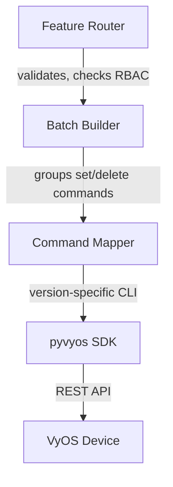
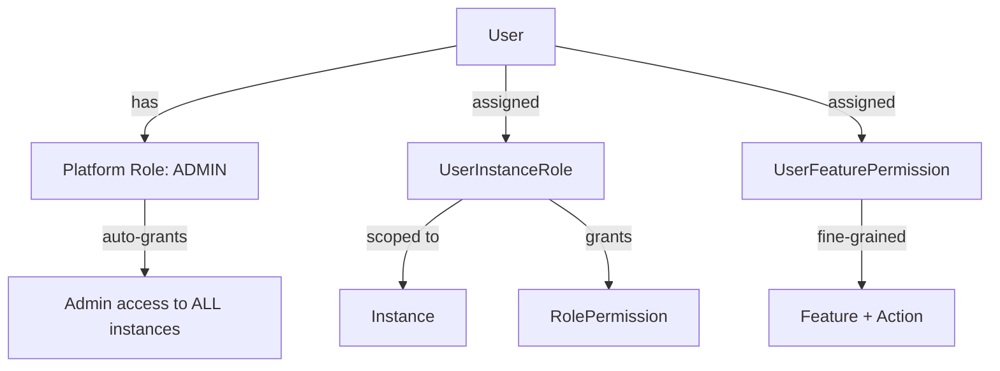
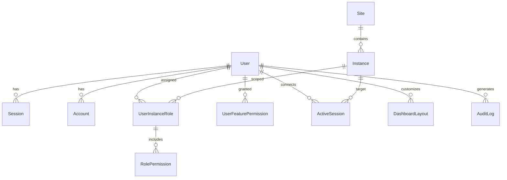
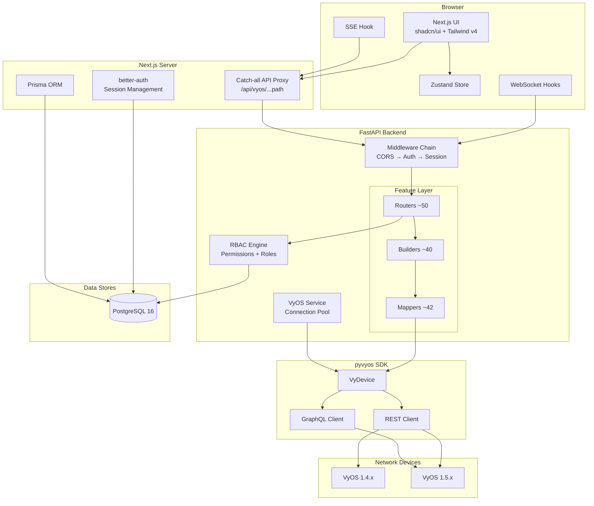

# VyManager Architecture

> Auto-generated from GitNexus knowledge graph (19,041 symbols, 300 execution flows, 68 functional modules)

## Overview

VyManager is a full-stack web application for managing VyOS routers. The frontend is a Next.js 16 App Router application that proxies all API requests through a catch-all route to a FastAPI backend. The backend communicates with VyOS devices via a custom `pyvyos` SDK that wraps the VyOS REST API.

The system supports multiple VyOS instances organized into sites, with role-based access control (RBAC), audit logging, version-aware command translation (VyOS 1.4 and 1.5), and real-time monitoring via SSE and WebSocket.

```
┌─────────────────────────────────────────────────────────────────┐
│                         Browser (Dark Mode UI)                  │
│                    Next.js App · shadcn/ui · Zustand            │
└──────────────────────────────┬──────────────────────────────────┘
                               │ HTTP / SSE / WebSocket
                               ▼
┌──────────────────────────────────────────────────────────────────┐
│              Next.js API Proxy  (catch-all route)                │
│         src/app/api/vyos/[...path]/route.ts                      │
└──────────────────────────────┬───────────────────────────────────┘
                               │ Forwards with session cookie
                               ▼
┌──────────────────────────────────────────────────────────────────┐
│                     FastAPI Backend (Python)                      │
│  ┌────────────┐  ┌──────────────────┐  ┌─────────────────────┐  │
│  │ CORS       │→ │ AuthMiddleware   │→ │ SessionMiddleware    │  │
│  │            │  │ (cookie→DB)      │  │ (resolve instance)   │  │
│  └────────────┘  └──────────────────┘  └─────────────────────┘  │
│                               │                                  │
│  ┌────────────────────────────▼──────────────────────────────┐  │
│  │                    Feature Routers (50+)                   │  │
│  │   firewall · bgp · ospf · nat · interfaces · vpn · ...    │  │
│  └────────────────────────────┬──────────────────────────────┘  │
│                               │                                  │
│  ┌────────────────────────────▼──────────────────────────────┐  │
│  │                  Batch Builders (40+)                       │  │
│  │   Groups related set/delete commands into atomic batches    │  │
│  └────────────────────────────┬──────────────────────────────┘  │
│                               │                                  │
│  ┌────────────────────────────▼──────────────────────────────┐  │
│  │              Command Mappers (42+ features)                │  │
│  │   Version-aware CLI translation (v1.4 / v1.5)             │  │
│  │   BaseMapper → v1_4 override │ v1_5 override              │  │
│  └────────────────────────────┬──────────────────────────────┘  │
│                               │                                  │
│  ┌────────────────────────────▼──────────────────────────────┐  │
│  │                    pyvyos SDK                              │  │
│  │   VyDevice · REST client · GraphQL · specs                 │  │
│  └────────────────────────────┬──────────────────────────────┘  │
└───────────────────────────────┼──────────────────────────────────┘
                                │ HTTPS (VyOS REST API)
                                ▼
                    ┌───────────────────────┐
                    │   VyOS Router(s)      │
                    │   1.4.x / 1.5.x       │
                    └───────────────────────┘
```

## Functional Areas

The codebase is organized into 68 functional modules. The largest by symbol count:

| Module | Symbols | Cohesion | Description |
|--------|---------|----------|-------------|
| **Vrf** | 740 | 97% | Virtual Routing & Forwarding (includes VRF-scoped BGP, OSPF, static routes) |
| **Firewall** | 682 | 77% | IPv4/IPv6 rules, chains, zones, bridge rules |
| **Bgp** | 612 | 74% | BGP neighbors, peer groups, address families |
| **Api** | 455 | 76% | Frontend API service layer and proxy infrastructure |
| **Load_balancing** | 330 | 92% | HAProxy backends, WAN load balancing |
| **Interfaces** | 284 | 80% | Ethernet, VLAN, tunnel, VxLAN, WireGuard |
| **Ospf** | 193 | 70% | OSPF areas, interfaces, redistribution |
| **Static_routes** | 150 | 71% | Static routes, routing tables, failover |
| **Isis** | 150 | 67% | IS-IS routing protocol |
| **High_availability** | 123 | 75% | VRRP, sync groups, virtual servers |
| **Failover** | 97 | 74% | Failover route management |
| **Nat** | 96 | 64% | Source, destination, and static NAT |
| **Mpls** | 92 | 71% | MPLS LDP interfaces, neighbors, targeted sessions |
| **Route** | 89 | 81% | Core routing infrastructure |
| **Route_map** | 80 | 52% | Route maps, policy matching |
| **Firewall_global_options** | 79 | 71% | Global firewall settings |
| **System** | 62 | 84% | System configuration (hostname, DNS, NTP, users) |
| **Bfd** | 61 | 72% | Bidirectional Forwarding Detection |
| **Snmp** | 58 | 96% | SNMP agent configuration |
| **Hooks** | 57 | 59% | React hooks (dashboard, monitoring, sessions) |

## Three-Layer Backend Pattern

Every VyOS feature follows this consistent architecture:



### Layer 1: Routers (`backend/routers/`)
~50 router modules define FastAPI endpoints. Each feature router exposes:
- `GET /capabilities` — version-aware feature availability
- `GET /config` — current configuration from the device
- `POST /batch` — atomic batch operations (create/update/delete)

Routers enforce RBAC via `require_read_permission` / `require_write_permission` decorators.

### Layer 2: Builders (`backend/vyos_builders/`)
~40 builder modules group related VyOS CLI commands into atomic batches. A single user action (e.g., "create BGP neighbor") may require multiple `set` and `delete` commands — the builder assembles them all before execution.

### Layer 3: Mappers (`backend/vyos_mappers/`)
~42 mapper modules translate abstract operations into version-specific VyOS CLI paths. The `CommandMapperRegistry` factory returns the correct mapper based on the device's VyOS version.

```
vyos_mappers/
  feature_name/
    feature_name.py              # Base mapper (v1.5 features)
    _versions/
      __init__.py                # Factory function
      v1_4.py                    # v1.4 overrides (blocks unsupported features)
      v1_5.py                    # v1.5 (usually inherits base directly)
```

### Layer 4: pyvyos SDK (`backend/pyvyos/`)
Custom Python SDK wrapping the VyOS REST/GraphQL API. Provides `VyDevice` for command execution, specs for device capabilities, and utilities.

## Key Execution Flows

### 1. Write Operation (e.g., Configure Interface)

```
configure_interface_batch (router)
  → require_write_permission (RBAC decorator)
    → require_permission → check_permission
      → get_user_permissions → _apply_parent_child_permissions
  → EthernetBatchBuilder.build() (builder)
    → EthernetMapper.set_* / delete_* (mapper)
      → VyDevice.configure_set/delete (pyvyos)
        → VyOS REST API
```

### 2. Read Operation (e.g., Get OSPF Config)

```
get_ospf_config (router)
  → require_read_permission (RBAC decorator)
    → require_permission → check_permission
      → get_user_permissions → _apply_parent_child_permissions
  → OspfMapper.parse_config() (mapper)
    → VyDevice.retrieve_show_config (pyvyos)
      → VyOS REST API
```

### 3. Frontend Request Flow

```
Browser Component
  → API service module (frontend/src/lib/api/*.ts)
    → fetch("/api/vyos/...")
      → Next.js catch-all proxy (api/vyos/[...path]/route.ts)
        → Forwards to FastAPI backend with session cookie
          → CORS → AuthMiddleware → SessionMiddleware → Router
```

### 4. Authentication Flow

```
Login Page → better-auth (Next.js)
  → Creates session in PostgreSQL
  → Sets signed session_token cookie
  → On API request: AuthMiddleware validates cookie against DB
  → SessionMiddleware resolves active VyOS instance → request.state.instance
```

### 5. Real-Time Monitoring

```
Dashboard SSE:
  Browser → useDashboardSSE hook → SSE endpoint → VyOS GraphQL subscription

Terminal WebSocket:
  Browser → useTerminalWebSocket hook → WebSocket → SSH session to VyOS device

Monitoring WebSocket:
  Browser → useMonitoringWebSocket hook → WebSocket → Backend → VyOS
```

## Middleware Chain

Executed bottom-up (Starlette convention):

```
Request → CORS → AuthenticationMiddleware → SessionMiddleware → Router
```

| Middleware | Responsibility |
|-----------|---------------|
| **CORS** | Origin validation, preflight handling |
| **AuthenticationMiddleware** | Validates `better-auth.session_token` cookie against PostgreSQL. Distinguishes polling from real activity for inactivity tracking. |
| **SessionMiddleware** | Resolves user's active VyOS instance, injects into `request.state.instance`. Wraps API keys in `_SecureStr` to prevent credential leakage. |

## RBAC Model



- **Platform ADMIN**: Automatic admin access to every instance
- **UserInstanceRole**: Per-instance role assignment (viewer, operator, admin)
- **UserFeaturePermission**: Fine-grained per-feature permissions
- **Parent-child permission inheritance**: Hierarchical feature permissions cascade

## Frontend Architecture

```
frontend/src/
├── app/
│   ├── (auth)/              # Login, onboarding (no app shell)
│   ├── (default)/
│   │   ├── (app)/           # Main app with sidebar layout
│   │   │   ├── containers/
│   │   │   ├── firewall/    # bridge, flowtables, global-options, groups, policies
│   │   │   ├── load-balancing/
│   │   │   ├── monitoring/
│   │   │   ├── network/     # interfaces, nat, vrf
│   │   │   ├── policies/    # local-route
│   │   │   ├── routing/     # infrastructure, multicast, static-failover, unicast
│   │   │   ├── settings/
│   │   │   ├── system/      # file-browser, services/*, settings, terminal
│   │   │   └── vpn/
│   │   ├── sites/           # Site/instance selection
│   │   └── layout.tsx       # Default layout wrapper
│   └── api/
│       ├── vyos/[...path]/  # Catch-all proxy to backend
│       └── session/[...path]/ # Session management proxy
├── components/              # 38+ feature component directories
├── contexts/                # React contexts (DashboardData)
├── hooks/                   # Custom hooks (SSE, WebSocket, Prometheus)
├── lib/api/                 # 60+ API service modules + types/
└── store/                   # Zustand stores (session-store)
```

### Key Frontend Patterns

- **API Client Singleton** (`lib/api/client.ts`): Resolves `/api` in browser, `BACKEND_URL` on server
- **Zustand Session Store**: Tracks active VyOS instance across the app
- **Route Groups**: `(auth)` for unauthenticated pages, `(default)/(app)` for the main app shell
- **Service Modules**: One TypeScript class per feature domain (60+ modules in `lib/api/`)
- **Dark mode only**: Hardcoded dark theme via Tailwind CSS v4

## Database Schema



Key models: `User`, `Session`, `Account` (better-auth), `Site`, `Instance` (multi-device), `ActiveSession` (VyOS connection tracking), `UserInstanceRole`, `UserFeaturePermission`, `RolePermission` (RBAC), `DashboardLayout` (per-user), `AuditLog`.

## System Architecture Diagram



## Feature Coverage

The following VyOS features are fully implemented across all layers (router + builder + mapper + frontend):

| Category | Features |
|----------|----------|
| **Routing** | BGP, OSPF, OSPFv3, IS-IS, BFD, Babel, MPLS, Static Routes, Failover, Route Maps |
| **Firewall** | IPv4/IPv6 Rules, Bridge Rules, Zones, Groups, Flowtables, Global Options |
| **Network** | Ethernet, VLAN, Tunnel, VxLAN, Source/Dest/Static NAT, VRF |
| **Services** | DHCP, DHCPv6, DNS Forwarding, NTP, SSH, SNMP, LLDP, TFTP, Broadcast Relay, Router Advert, Conntrack Sync |
| **VPN** | WireGuard, IPsec |
| **Load Balancing** | HAProxy (backends, rules, services), WAN Load Balancing |
| **High Availability** | VRRP Groups, Sync Groups, Virtual Servers |
| **Policies** | Access Lists, Prefix Lists, AS Path Lists, Community Lists, Route Maps, Local Routes |
| **System** | Settings, User Management, Power Control, Containers, File Browser, Terminal |
| **Monitoring** | Dashboard (SSE), Prometheus integration, Real-time monitoring (WebSocket) |
